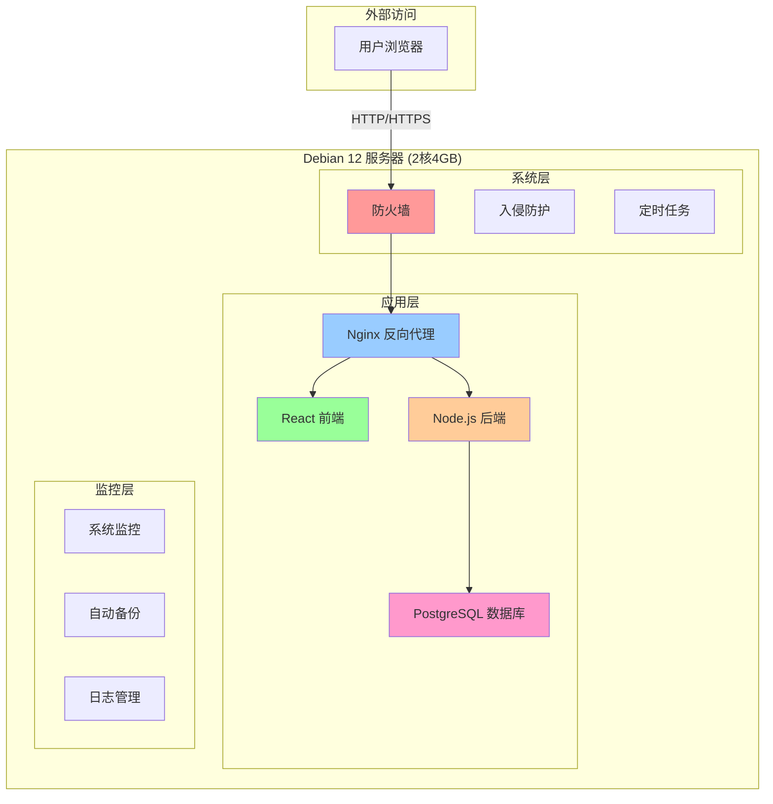

# LearnFlow Debian 12 服务器部署指南

## 🎯 概述

这是针对**2核4GB Debian 12服务器**优化的完整部署方案，经过精心调优，确保在有限资源下稳定运行。

## 🏗️ 架构图



## 📋 系统要求

### 最低配置
- **CPU**: 2核心
- **内存**: 4GB RAM
- **存储**: 20GB 可用空间
- **系统**: Debian 12 (Bookworm)

### 推荐配置
- **CPU**: 4核心
- **内存**: 8GB RAM
- **存储**: 50GB SSD
- **系统**: Debian 12 (Bookworm)

## 🚀 快速部署

### 步骤1: 准备服务器

```bash
# 连接到服务器
ssh user@your-server-ip

# 更新系统
sudo apt update && sudo apt upgrade -y

# 安装Git
sudo apt install -y git

# 克隆项目
git clone https://github.com/your-username/learnflow.git
cd learnflow
```

### 步骤2: 运行安装脚本

```bash
# 给脚本执行权限
chmod +x install-debian.sh
chmod +x deploy-debian.sh

# 运行安装脚本（配置系统环境）
./install-debian.sh
```

### 步骤3: 部署应用

```bash
# 启动所有服务
./deploy-debian.sh start

# 查看服务状态
./deploy-debian.sh status

# 查看日志
./deploy-debian.sh logs
```

## 📊 资源分配

### 内存分配 (4GB总内存)
| 服务 | 内存限制 | 说明 |
|------|----------|------|
| PostgreSQL | 512MB | 数据库服务 |
| Node.js后端 | 512MB | API服务 |
| Nginx前端 | 256MB | 静态文件服务 |
| Nginx代理 | 256MB | 反向代理 |
| 系统预留 | 2.5GB | 操作系统和其他服务 |

### CPU分配 (2核总CPU)
| 服务 | CPU限制 | 说明 |
|------|---------|------|
| PostgreSQL | 0.5核 | 数据库查询处理 |
| Node.js后端 | 0.5核 | API请求处理 |
| Nginx前端 | 0.25核 | 静态文件服务 |
| Nginx代理 | 0.25核 | 请求路由 |
| 系统预留 | 0.5核 | 操作系统和其他进程 |

## 🔧 配置说明

### 1. PostgreSQL优化配置

```bash
# 内存优化
shared_buffers = 256MB          # 总内存的6.25%
effective_cache_size = 1GB      # 总内存的25%
work_mem = 4MB                  # 每个查询的内存
maintenance_work_mem = 64MB     # 维护操作内存

# 连接优化
max_connections = 50            # 减少连接数，节省内存
autovacuum_max_workers = 2     # 减少工作进程数

# 性能优化
random_page_cost = 1.1          # SSD优化
effective_io_concurrency = 200  # SSD并发IO
```

### 2. Node.js优化配置

```bash
# 内存限制
NODE_OPTIONS="--max-old-space-size=512"

# 进程管理
# 使用dumb-init作为PID 1，更好地处理信号
# 启用健康检查，自动重启失败的服务
```

### 3. Nginx优化配置

```bash
# 工作进程
worker_processes 2;              # 2核CPU，设置2个工作进程
worker_cpu_affinity 01 10;      # CPU亲和性绑定

# 连接优化
worker_connections 512;          # 减少连接数，节省内存
keepalive_timeout 30;           # 减少超时时间
keepalive_requests 100;         # 减少每个连接的请求数

# 压缩优化
gzip_comp_level 4;              # 降低压缩级别，节省CPU
```

## 🛡️ 安全配置

### 防火墙规则 (UFW)

```bash
# 默认策略
sudo ufw default deny incoming
sudo ufw default allow outgoing

# 允许的服务
sudo ufw allow ssh              # SSH连接
sudo ufw allow 80/tcp           # HTTP
sudo ufw allow 443/tcp          # HTTPS

# 限制Docker端口访问
sudo ufw allow from 127.0.0.1 to any port 5432  # 数据库仅本地访问
sudo ufw allow from 127.0.0.1 to any port 3000  # 后端仅本地访问
```

### 入侵防护 (Fail2ban)

```bash
# SSH保护配置
[DEFAULT]
bantime = 3600          # 封禁时间1小时
findtime = 600          # 检测时间10分钟
maxretry = 3            # 最大尝试次数

[sshd]
enabled = true          # 启用SSH保护
maxretry = 3            # SSH最大尝试次数
bantime = 3600          # SSH封禁时间
```

## 📈 性能优化

### 系统级优化

```bash
# 网络优化
net.core.rmem_max = 16777216
net.core.wmem_max = 16777216
net.ipv4.tcp_congestion_control = bbr
net.core.default_qdisc = fq

# 文件系统优化
vm.swappiness = 10
vm.dirty_ratio = 15
vm.dirty_background_ratio = 5

# 进程优化
kernel.pid_max = 65536
```

### 应用级优化

```bash
# 静态资源缓存
location ~* \.(js|css|png|jpg|jpeg|gif|ico|svg)$ {
    expires 1y;
    add_header Cache-Control "public, immutable";
}

# API限流
limit_req_zone $binary_remote_addr zone=api:10m rate=10r/s;
limit_req zone=api burst=20 nodelay;

# 登录接口更严格限流
limit_req_zone $binary_remote_addr zone=login:10m rate=5r/s;
limit_req zone=login burst=10 nodelay;
```

## 🔍 监控和维护

### 自动监控

```bash
# 系统监控脚本 (每5分钟执行)
/opt/learnflow/monitor.sh

# 监控内容
- 磁盘使用率 (>80%告警)
- 内存使用率 (>90%告警)
- Docker服务状态
- 应用健康状态
```

### 自动备份

```bash
# 数据库备份脚本 (每天凌晨2点执行)
/opt/learnflow/backup.sh

# 备份策略
- 每天自动备份
- 保留最近7天备份
- 自动压缩备份文件
- 清理过期备份
```

### 日志管理

```bash
# 日志轮转配置
/var/log/learnflow/*.log {
    daily                    # 每天轮转
    rotate 7                # 保留7天
    compress                # 压缩旧日志
    missingok               # 文件不存在时不报错
}
```

## 📝 管理命令

### 服务管理

```bash
# 启动服务
./deploy-debian.sh start

# 停止服务
./deploy-debian.sh stop

# 重启服务
./deploy-debian.sh restart

# 查看状态
./deploy-debian.sh status

# 查看日志
./deploy-debian.sh logs

# 健康检查
./deploy-debian.sh health

# 性能监控
./deploy-debian.sh monitor
```

### 系统管理

```bash
# 查看防火墙状态
sudo ufw status

# 查看fail2ban状态
sudo fail2ban-client status

# 查看系统资源
htop
free -h
df -h

# 查看Docker资源使用
docker stats
docker system df
```

## 🚨 故障排除

### 常见问题

#### 1. 内存不足
```bash
# 检查内存使用
free -h
docker stats

# 解决方案
- 重启占用内存较多的容器
- 检查是否有内存泄漏
- 考虑增加swap空间
```

#### 2. 磁盘空间不足
```bash
# 检查磁盘使用
df -h
docker system df

# 解决方案
- 清理Docker镜像和容器
- 清理日志文件
- 清理备份文件
```

#### 3. 服务无法启动
```bash
# 查看服务日志
./deploy-debian.sh logs

# 检查端口占用
sudo netstat -tulpn | grep :80

# 检查Docker状态
docker info
```

### 性能调优

#### 1. 数据库性能
```bash
# 查看慢查询
docker-compose exec postgres tail -f /var/log/postgresql/postgresql-*.log

# 优化查询
- 添加适当的索引
- 优化SQL语句
- 调整PostgreSQL参数
```

#### 2. 应用性能
```bash
# 查看响应时间
curl -w "@curl-format.txt" -o /dev/null -s http://localhost

# 性能优化
- 启用Gzip压缩
- 配置静态资源缓存
- 优化API响应
```

## 🔒 安全建议

### 生产环境配置

1. **修改默认密码**
   ```bash
   # 修改数据库密码
   export POSTGRES_PASSWORD="your-strong-password"
   
   # 修改JWT密钥
   export JWT_SECRET="your-very-long-random-secret"
   ```

2. **配置SSL证书**
   ```bash
   # 使用Let's Encrypt免费证书
   sudo apt install certbot python3-certbot-nginx
   sudo certbot --nginx -d your-domain.com
   ```

3. **定期安全更新**
   ```bash
   # 设置自动安全更新
   sudo apt install unattended-upgrades
   sudo dpkg-reconfigure -plow unattended-upgrades
   ```

4. **监控和告警**
   ```bash
   # 配置邮件告警
   # 配置监控面板
   # 设置日志分析
   ```

## 📚 相关文档

- [Debian 12 官方文档](https://www.debian.org/releases/bookworm/)
- [Docker 官方文档](https://docs.docker.com/)
- [PostgreSQL 优化指南](https://www.postgresql.org/docs/current/runtime-config-resource.html)
- [Nginx 性能调优](https://nginx.org/en/docs/)
- [系统监控最佳实践](https://www.datadoghq.com/blog/monitoring-101-collecting-data/)

## 🤝 技术支持

如果遇到问题，请：

1. 查看服务日志: `./deploy-debian.sh logs`
2. 执行健康检查: `./deploy-debian.sh health`
3. 检查服务状态: `./deploy-debian.sh status`
4. 查看系统监控: `./deploy-debian.sh monitor`
5. 检查系统资源: `htop`, `free -h`, `df -h`

---

**注意**: 这是一个生产就绪的部署方案，但在生产环境中使用前，请务必：
- 修改所有默认密码和密钥
- 配置SSL证书
- 设置适当的防火墙规则
- 配置监控和告警
- 制定备份和恢复策略
- 定期进行安全更新
