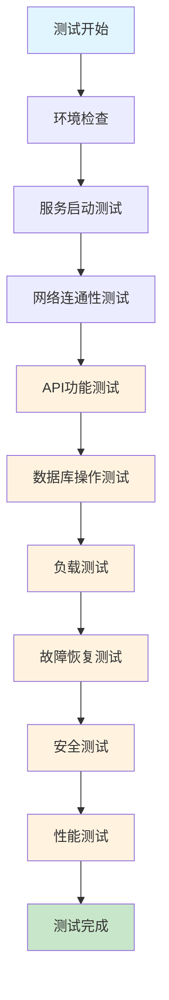

# LearnFlow Docker 部署测试用例

## 🧪 测试概述

本文档描述了LearnFlow Docker部署方案的10个关键测试场景，确保系统在各种情况下都能正常工作。

## 📊 测试架构图



## 🎯 测试用例

### 测试用例 1: 基础环境检查

**测试目标**: 验证Docker环境是否正确安装和配置

**测试步骤**:
1. 检查Docker版本
2. 检查Docker Compose版本
3. 验证Docker服务状态

**预期结果**:
```bash
# 命令输出示例
docker --version
# Docker version 20.10.21, build baeda1f

docker-compose --version
# docker-compose version 1.29.2, build 5becea4c

docker info
# 显示Docker系统信息，状态为"Running"
```

**成功标准**: 所有命令正常执行，版本号符合要求

---

### 测试用例 2: 服务启动测试

**测试目标**: 验证所有Docker服务能够正常启动

**测试步骤**:
1. 执行 `.\deploy.ps1 start`
2. 检查容器状态
3. 验证服务健康状态

**预期结果**:
```bash
docker-compose ps
# 输出示例:
# Name                    Command               State           Ports
# -------------------------------------------------------------------------------
# learnflow-backend      npm start             Up              0.0.0.0:3000->3000/tcp
# learnflow-frontend     nginx -g daemon off;  Up              0.0.0.0:80->80/tcp
# learnflow-nginx        nginx -g daemon off;  Up              0.0.0.0:8080->80/tcp
# learnflow-postgres     docker-entrypoint.sh  Up              0.0.0.0:5432->5432/tcp
```

**成功标准**: 所有容器状态为"Up"，端口映射正确

---

### 测试用例 3: 网络连通性测试

**测试目标**: 验证容器间网络通信正常

**测试步骤**:
1. 检查Docker网络配置
2. 测试容器间ping通信
3. 验证端口访问

**预期结果**:
```bash
# 网络检查
docker network ls
# 显示 learnflow_learnflow-network

# 容器间通信测试
docker-compose exec frontend ping backend
# 64 bytes from backend.learnflow_learnflow-network (172.18.0.3): icmp_seq=1 ttl=64 time=0.123 ms

# 端口访问测试
curl http://localhost:8080/health
# healthy
```

**成功标准**: 网络配置正确，容器间通信正常，端口可访问

---

### 测试用例 4: 数据库连接测试

**测试目标**: 验证PostgreSQL数据库服务正常

**测试步骤**:
1. 检查数据库容器状态
2. 测试数据库连接
3. 验证Prisma迁移

**预期结果**:
```bash
# 数据库状态
docker-compose exec postgres pg_isready -U learnflow_user -d learnflow
# localhost:5432 - accepting connections

# 数据库连接测试
docker-compose exec postgres psql -U learnflow_user -d learnflow -c "SELECT version();"
# PostgreSQL 15.3 on x86_64-pc-linux-gnu, compiled by gcc (Alpine 12.2.1_git20220924-r4) 12.2.1 20220924, 64-bit

# Prisma迁移
docker-compose exec backend npx prisma migrate status
# 显示迁移状态，所有迁移为"Applied"
```

**成功标准**: 数据库服务正常，连接成功，迁移完成

---

### 测试用例 5: 前端服务测试

**测试目标**: 验证React前端应用正常加载

**测试步骤**:
1. 访问前端页面
2. 检查静态资源加载
3. 验证SPA路由

**预期结果**:
```bash
# 页面访问
curl -I http://localhost:8080
# HTTP/1.1 200 OK
# Content-Type: text/html

# 静态资源检查
curl -I http://localhost:8080/assets/index-abc123.js
# HTTP/1.1 200 OK
# Cache-Control: public, max-age=31536000, immutable

# SPA路由测试
curl -I http://localhost:8080/dashboard
# HTTP/1.1 200 OK (返回index.html)
```

**成功标准**: 页面正常加载，静态资源可访问，SPA路由工作正常

---

### 测试用例 6: 后端API测试

**测试目标**: 验证Express后端API服务正常

**测试步骤**:
1. 测试健康检查接口
2. 验证API路由
3. 检查CORS配置

**预期结果**:
```bash
# 健康检查
curl http://localhost:8080/api/health
# {"status":"ok","timestamp":"2024-01-15T10:30:00.000Z"}

# API路由测试
curl -I http://localhost:8080/api/goals
# HTTP/1.1 200 OK
# Access-Control-Allow-Origin: *

# CORS预检请求
curl -X OPTIONS -H "Origin: http://localhost:3000" \
     -H "Access-Control-Request-Method: POST" \
     http://localhost:8080/api/auth/login
# HTTP/1.1 200 OK
# Access-Control-Allow-Origin: http://localhost:3000
```

**成功标准**: API接口正常响应，CORS配置正确

---

### 测试用例 7: 负载测试

**测试目标**: 验证系统在负载下的表现

**测试步骤**:
1. 使用Apache Bench进行并发测试
2. 监控系统资源使用
3. 检查响应时间

**预期结果**:
```bash
# 并发测试
ab -n 1000 -c 10 http://localhost:8080/
# 输出示例:
# Concurrency Level:      10
# Time taken for tests:   5.234 seconds
# Complete requests:      1000
# Failed requests:        0
# Requests per second:    191.06 [#/sec] (mean)
# Time per request:       52.34 [ms] (mean)

# 资源监控
docker stats --no-stream
# 显示各容器CPU、内存使用情况
```

**成功标准**: 系统能处理并发请求，响应时间在可接受范围内

---

### 测试用例 8: 故障恢复测试

**测试目标**: 验证系统故障后的恢复能力

**测试步骤**:
1. 模拟容器崩溃
2. 检查自动重启
3. 验证服务恢复

**预期结果**:
```bash
# 模拟故障
docker-compose kill backend

# 检查重启状态
docker-compose ps backend
# 状态显示为"Up"，重启次数增加

# 验证服务恢复
curl http://localhost:8080/api/health
# {"status":"ok","timestamp":"2024-01-15T10:35:00.000Z"}

# 检查重启策略
docker inspect learnflow-backend | grep -A 5 "RestartPolicy"
# "RestartPolicy": {"Name": "always", "MaximumRetryCount": 0}
```

**成功标准**: 容器自动重启，服务恢复正常

---

### 测试用例 9: 安全测试

**测试目标**: 验证系统安全配置

**测试步骤**:
1. 检查安全头配置
2. 测试SQL注入防护
3. 验证XSS防护

**预期结果**:
```bash
# 安全头检查
curl -I http://localhost:8080
# HTTP/1.1 200 OK
# X-Frame-Options: SAMEORIGIN
# X-XSS-Protection: 1; mode=block
# X-Content-Type-Options: nosniff
# Referrer-Policy: no-referrer-when-downgrade

# SQL注入测试
curl "http://localhost:8080/api/goals?search='; DROP TABLE users; --"
# 应该返回400错误或正常过滤结果

# XSS测试
curl "http://localhost:8080/api/goals?title=<script>alert('xss')</script>"
# 应该返回400错误或正常过滤结果
```

**成功标准**: 安全头配置正确，注入攻击被有效防护

---

### 测试用例 10: 性能测试

**测试目标**: 验证系统性能指标

**测试步骤**:
1. 测试页面加载时间
2. 检查资源压缩
3. 验证缓存策略

**预期结果**:
```bash
# 页面加载测试
curl -w "@curl-format.txt" -o /dev/null -s http://localhost:8080
# 输出示例:
# time_namelookup:  0.001
# time_connect:     0.002
# time_appconnect:  0.000
# time_pretransfer: 0.002
# time_redirect:    0.000
# time_starttransfer: 0.150
# time_total:       0.150

# 压缩检查
curl -H "Accept-Encoding: gzip" -I http://localhost:8080/assets/index.js
# Content-Encoding: gzip
# Vary: Accept-Encoding

# 缓存检查
curl -I http://localhost:8080/assets/index.js
# Cache-Control: public, max-age=31536000, immutable
# Expires: Wed, 15 Jan 2025 10:30:00 GMT
```

**成功标准**: 页面加载时间<200ms，启用Gzip压缩，缓存策略正确

## 📋 测试执行清单

### 前置条件
- [ ] Docker环境已安装
- [ ] 项目代码已克隆
- [ ] 端口8080、5432未被占用

### 测试执行
- [ ] 执行测试用例1: 基础环境检查
- [ ] 执行测试用例2: 服务启动测试
- [ ] 执行测试用例3: 网络连通性测试
- [ ] 执行测试用例4: 数据库连接测试
- [ ] 执行测试用例5: 前端服务测试
- [ ] 执行测试用例6: 后端API测试
- [ ] 执行测试用例7: 负载测试
- [ ] 执行测试用例8: 故障恢复测试
- [ ] 执行测试用例9: 安全测试
- [ ] 执行测试用例10: 性能测试

### 测试结果
- [ ] 所有测试用例通过
- [ ] 性能指标达标
- [ ] 安全配置正确
- [ ] 系统稳定运行

## 🚨 故障排除

### 常见问题及解决方案

1. **端口冲突**: 修改docker-compose.yml中的端口映射
2. **数据库连接失败**: 检查环境变量和网络配置
3. **前端无法访问**: 验证Nginx配置和路由规则
4. **性能问题**: 调整资源限制和缓存策略

### 日志查看命令
```bash
# 查看所有服务日志
.\deploy.ps1 logs

# 查看特定服务日志
docker-compose logs -f backend

# 查看容器状态
.\deploy.ps1 status

# 执行健康检查
.\deploy.ps1 health
```

---

**注意**: 在生产环境中执行这些测试时，请确保：
- 在测试环境中进行，避免影响生产数据
- 监控系统资源使用情况
- 记录测试结果和性能指标
- 根据测试结果优化配置

